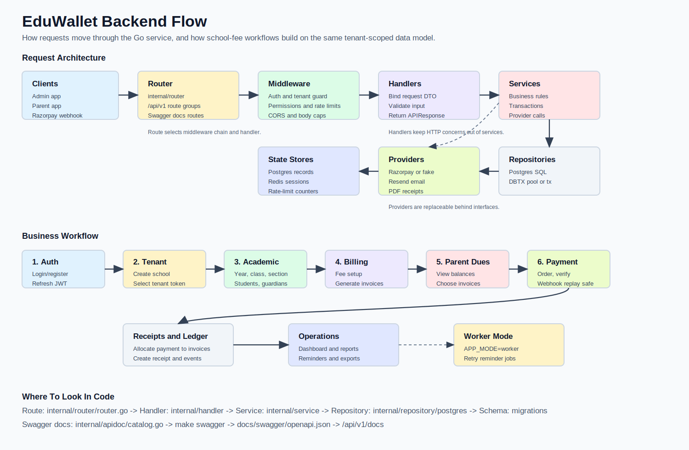
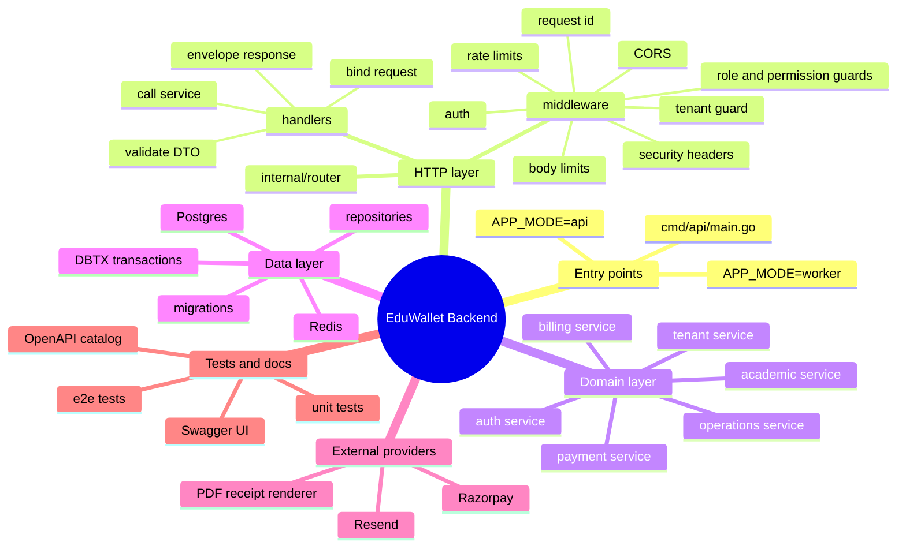
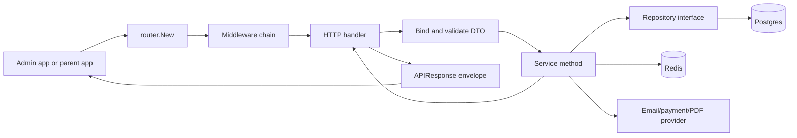
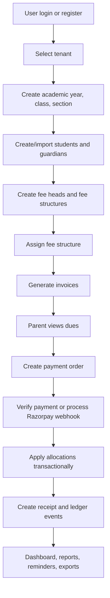

# EduWallet Project Flow

Use this document to understand how a request moves through the backend and how the school-fee product workflow is modeled.

For a non-technical school tester path through Swagger, use `docs/SCHOOL_TEST_JOURNEY.md`.

## Architecture Image

## Architecture Mindmap

## Request Flow

## Product Workflow

## Layer Responsibilities

| Layer | Location | Responsibility |
|-------|----------|----------------|
| Entry point | `cmd/api/main.go` | Load config, connect Postgres/Redis, wire repositories, services, handlers, and router. |
| Router | `internal/router/router.go` | Own route paths and attach middleware for auth, tenant context, permissions, limits, and rate limits. |
| Handler | `internal/handler` | Bind JSON/form/query/path data, validate DTOs, get actor/tenant context, call services, format responses. |
| Service | `internal/service` | Enforce business rules, execute transactions, coordinate repositories and providers. |
| Repository | `internal/repository/postgres` | Run SQL through `database.DBTX`; no HTTP or provider logic belongs here. |
| Model/DTO | `internal/model`, `internal/dto` | Keep database/domain shape separate from API request and response shape. |
| Migration | `migrations` | Own schema changes and rollback scripts. |
| Tests | `tests`, `internal/*/*_test.go` | Unit tests for narrow logic and e2e tests for real API/database behavior. |
| API docs | `internal/apidoc`, `docs/swagger` | OpenAPI catalog, generated Swagger JSON, and route coverage tests. |

## Main Business Modules

| Module | What it owns | Main endpoints |
|--------|--------------|----------------|
| Auth | Login, registration, refresh, tenant-token selection, logout, password reset. | `/api/v1/auth/*` |
| Tenants | Platform tenant creation, tenant profile update, branch creation. | `/api/v1/platform/tenants`, `/api/v1/admin/tenant` |
| Academic | Years, classes, sections, students, guardians, imports. | `/api/v1/admin/academic-years`, `/classes`, `/sections`, `/students`, `/guardians`, `/imports` |
| Billing | Fee heads, structures, assignments, invoices, student ledger, parent dues. | `/api/v1/admin/fee-*`, `/invoices`, `/students/:id/ledger`, `/parent/children/:id/dues` |
| Payments | Parent orders, verification, Razorpay webhooks, offline payments, receipts, events. | `/api/v1/parent/payments/*`, `/api/v1/webhooks/razorpay`, `/api/v1/admin/payments`, `/receipts` |
| Operations | Reminder templates/rules, reminder sends, logs, dashboard, reports, exports. | `/api/v1/admin/reminder-*`, `/dashboard`, `/reports/*`, `/exports` |

## How To Change A Feature

1. Start from the route in `internal/router/router.go`.
2. Read the handler method in `internal/handler`.
3. Follow the service method in `internal/service`.
4. Check repository SQL in `internal/repository/postgres`.
5. Add or update DTOs in `internal/dto`.
6. Add migrations when the data shape changes.
7. Update `internal/apidoc/catalog.go` for new or changed API routes.
8. Run `make swagger` and `make test`.
