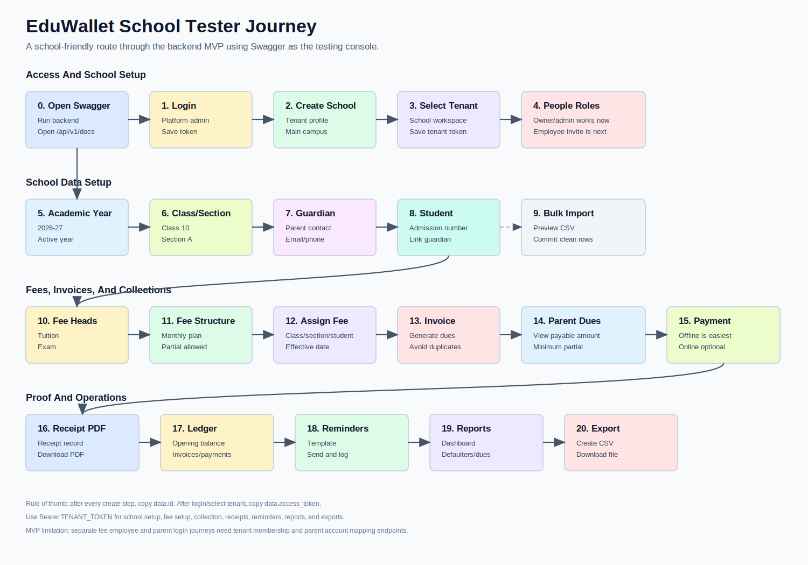
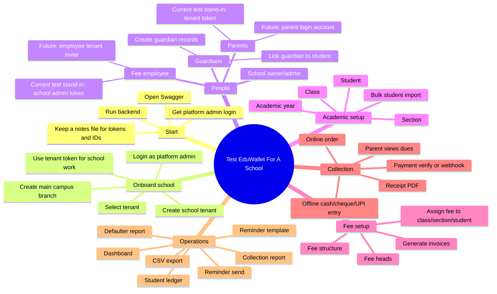
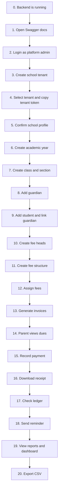

# School Tester Journey

This guide is for a school owner, principal, accountant, or operations person who wants to test EduWallet from start to finish.

EduWallet backend does not include a finished web dashboard yet. For this MVP, Swagger is the testing screen:

```text
http://localhost:8080/api/v1/docs
```

In Swagger, each API section behaves like a button-based test console. Open an endpoint, click **Try it out**, paste the sample data, click **Execute**, and copy the IDs or tokens from the response.

## Journey Image



## One-Page Mindmap



## Full Product Flow



## Important MVP Notes

| Topic | What works now | What is not finished yet |
|-------|----------------|--------------------------|
| School onboarding | A `super_admin` can create a school tenant and assign an owner user. | A self-service school signup page is not available yet. |
| Employee accounts | `/api/v1/admin/users` can create users such as `admin` or `staff`. | There is no API endpoint yet to attach that employee to a specific school tenant. For end-to-end fee testing, use the school owner/admin tenant token. |
| Fee employee workflow | The school owner/admin token can create fee heads, fee structures, invoices, payments, reports, and exports. | A separate fee employee login needs tenant membership invite/assignment support. |
| Guardians | Guardian records can be created and linked to students. | A guardian login portal is not finished yet. |
| Parent payments | Parent dues and payment endpoints exist. | For testing, call parent endpoints with the tenant token until parent account mapping is added. |
| Online payment | Fake local provider and Razorpay provider are supported. | Local fake online verification needs a generated HMAC signature, so offline payment is easier for non-technical testing. |

## What To Keep In Notes

Create a notes file before testing and paste these values as you go:

```text
PLATFORM_TOKEN=
OWNER_USER_ID=
TENANT_ID=
TENANT_TOKEN=
ACADEMIC_YEAR_ID=
CLASS_ID=
SECTION_ID=
GUARDIAN_ID=
STUDENT_ID=
FEE_HEAD_TUITION_ID=
FEE_HEAD_EXAM_ID=
FEE_STRUCTURE_ID=
FEE_ASSIGNMENT_ID=
INVOICE_ID=
PAYMENT_ID=
RECEIPT_ID=
EXPORT_ID=
```

Every normal API response has this shape:

```json
{
  "success": true,
  "request_id": "...",
  "data": {}
}
```

Most IDs are inside `data.id`. Tokens are inside `data.access_token`.

## Phase 0: Start The Project

Ask the developer/operator to run:

```bash
cp .env.example .env
make docker-up
make migrate-up
make dev
```

Open:

```text
http://localhost:8080/api/v1/docs
```

Health check in Swagger:

| Swagger section | Endpoint | Expected result |
|-----------------|----------|-----------------|
| Health | `GET /api/v1/healthz` | `status: ok` |
| Health | `GET /api/v1/readyz` | Postgres and Redis show `up` |

## Phase 1: Get A Platform Admin Login

For a real school test, someone must give you a platform admin account first. This account needs the `super_admin` role because school creation is a platform-level action.

Use Swagger:

| Step | Swagger section | Endpoint | What to save |
|------|-----------------|----------|--------------|
| Login | Auth | `POST /api/v1/auth/login` | `PLATFORM_TOKEN` and `OWNER_USER_ID` |

Sample body:

```json
{
  "email": "platform@example.com",
  "password": "password123"
}
```

After the response:

1. Copy `data.access_token` into `PLATFORM_TOKEN`.
2. Copy `data.user.id` into `OWNER_USER_ID`.
3. In Swagger, click **Authorize**.
4. Enter `Bearer PLATFORM_TOKEN`.

Registration note: `POST /api/v1/auth/register` creates a basic user in development, but that user cannot create a school until a platform admin gives it the right role or uses it as the school owner during tenant creation.

## Phase 2: Create The School

This creates the school account, also called a tenant.

| Swagger section | Endpoint | Authorization |
|-----------------|----------|---------------|
| Platform Tenants | `POST /api/v1/platform/tenants` | `Bearer PLATFORM_TOKEN` |

Sample body:

```json
{
  "name": "Acme Public School",
  "slug": "acme-public-school",
  "legal_name": "Acme Public School",
  "contact_email": "admin@acme-school.test",
  "contact_phone": "9000000000",
  "owner_user_id": "PASTE_OWNER_USER_ID_HERE",
  "branch": {
    "name": "Main Campus",
    "code": "MAIN"
  },
  "address": {
    "line1": "School Road",
    "city": "Bengaluru",
    "state": "Karnataka",
    "postal_code": "560001",
    "country": "India"
  }
}
```

Expected result:

- Response status is `201`.
- Save `data.id` as `TENANT_ID`.
- The owner user becomes a school `admin` member.

## Phase 3: Enter The School Workspace

Before doing school work, select the tenant. This returns a tenant-scoped token.

| Swagger section | Endpoint | Authorization |
|-----------------|----------|---------------|
| Auth | `POST /api/v1/auth/select-tenant` | `Bearer PLATFORM_TOKEN` |

Sample body:

```json
{
  "tenant_id": "PASTE_TENANT_ID_HERE"
}
```

Expected result:

- Save `data.access_token` as `TENANT_TOKEN`.
- In Swagger, click **Authorize** again.
- Replace the old token with `Bearer TENANT_TOKEN`.

Quick check:

| Swagger section | Endpoint | Expected result |
|-----------------|----------|-----------------|
| Tenant | `GET /api/v1/admin/tenant` | Shows your school name |

## Phase 4: Understand People And Roles

Use this as the product-language map:

| Person | Meaning in school | Current API testing path |
|--------|-------------------|--------------------------|
| Platform admin | EduWallet operator who creates schools. | Uses `PLATFORM_TOKEN`. |
| School owner/admin | Principal, school owner, or main office admin. | Uses `TENANT_TOKEN`. |
| Fee employee | Accountant who manages fee setup and collections. | For now, use the school admin `TENANT_TOKEN` to test fee work. |
| Guardian | Parent/guardian contact attached to a student. | Create through guardian endpoints. |
| Parent | Person who checks dues and pays. | Parent endpoints exist, but use `TENANT_TOKEN` during MVP testing. |

Optional platform user test:

| Swagger section | Endpoint | Purpose |
|-----------------|----------|---------|
| Admin Users | `POST /api/v1/admin/users` | Create a login user record, for example an accountant. |

Sample body:

```json
{
  "email": "fees@acme-school.test",
  "password": "password123",
  "first_name": "Fee",
  "last_name": "Manager",
  "roles": ["admin"]
}
```

Important: this creates the user, but the API does not yet expose a non-technical endpoint to attach that employee to the school tenant. Continue the school test using `TENANT_TOKEN`.

## Phase 5: Create Academic Setup

Create the academic year first.

| Swagger section | Endpoint | Save |
|-----------------|----------|------|
| Academic Setup | `POST /api/v1/admin/academic-years` | `ACADEMIC_YEAR_ID` |

```json
{
  "name": "Academic Year 2026-27",
  "code": "2026-27",
  "start_date": "2026-04-01",
  "end_date": "2027-03-31",
  "is_active": true
}
```

Create a class.

| Swagger section | Endpoint | Save |
|-----------------|----------|------|
| Academic Setup | `POST /api/v1/admin/classes` | `CLASS_ID` |

```json
{
  "name": "Class 10",
  "code": "10",
  "sort_order": 10
}
```

Create a section.

| Swagger section | Endpoint | Save |
|-----------------|----------|------|
| Academic Setup | `POST /api/v1/admin/sections` | `SECTION_ID` |

```json
{
  "academic_year_id": "PASTE_ACADEMIC_YEAR_ID_HERE",
  "class_id": "PASTE_CLASS_ID_HERE",
  "name": "Section A",
  "code": "A",
  "capacity": 40
}
```

Quick checks:

- `GET /api/v1/admin/academic-years`
- `GET /api/v1/admin/classes`
- `GET /api/v1/admin/sections`

## Phase 6: Add Guardians

Create the guardian before creating the student.

| Swagger section | Endpoint | Save |
|-----------------|----------|------|
| Students | `POST /api/v1/admin/guardians` | `GUARDIAN_ID` |

```json
{
  "name": "Riya Sharma",
  "relationship": "mother",
  "phone": "9000000000",
  "email": "riya.sharma@example.test",
  "preferred_language": "en",
  "communication_opt_in": true,
  "address": {
    "line1": "12 Lake View Road",
    "city": "Bengaluru",
    "state": "Karnataka",
    "postal_code": "560001",
    "country": "India"
  }
}
```

## Phase 7: Add Students

Create one student manually.

| Swagger section | Endpoint | Save |
|-----------------|----------|------|
| Students | `POST /api/v1/admin/students` | `STUDENT_ID` |

```json
{
  "academic_year_id": "PASTE_ACADEMIC_YEAR_ID_HERE",
  "class_id": "PASTE_CLASS_ID_HERE",
  "section_id": "PASTE_SECTION_ID_HERE",
  "admission_number": "ADM-100",
  "first_name": "Aarav",
  "last_name": "Sharma",
  "roll_number": "7",
  "status": "active",
  "category": "general",
  "opening_balance_paise": 125000,
  "guardians": [
    {
      "guardian_id": "PASTE_GUARDIAN_ID_HERE",
      "relationship": "mother",
      "is_primary": true
    }
  ]
}
```

Amount note: values ending in `_paise` are in paise. `125000` means INR 1,250.

Quick checks:

| Swagger section | Endpoint | Expected result |
|-----------------|----------|-----------------|
| Students | `GET /api/v1/admin/students?search=aarav` | Shows Aarav Sharma |
| Students | `GET /api/v1/admin/students/{id}` | Shows student and linked guardian |

Bulk import test:

1. Use fixture file `docs/fixtures/pilot_students.csv`.
2. Open `POST /api/v1/admin/imports/students/preview`.
3. Upload the CSV or paste CSV content as JSON.
4. Save `data.import_id`.
5. Open `POST /api/v1/admin/imports/students/commit`.
6. Submit the `import_id`.

## Phase 8: Create Fee Heads

Fee heads are labels such as tuition, exam, transport, or hostel.

Create Tuition Fee.

| Swagger section | Endpoint | Save |
|-----------------|----------|------|
| Billing | `POST /api/v1/admin/fee-heads` | `FEE_HEAD_TUITION_ID` |

```json
{
  "name": "Tuition Fee",
  "code": "TUITION",
  "category": "tuition",
  "status": "active"
}
```

Create Exam Fee.

| Swagger section | Endpoint | Save |
|-----------------|----------|------|
| Billing | `POST /api/v1/admin/fee-heads` | `FEE_HEAD_EXAM_ID` |

```json
{
  "name": "Exam Fee",
  "code": "EXAM",
  "category": "exam",
  "status": "active"
}
```

## Phase 9: Create Fee Structure

A fee structure is the amount plan for a class, section, or student.

| Swagger section | Endpoint | Save |
|-----------------|----------|------|
| Billing | `POST /api/v1/admin/fee-structures` | `FEE_STRUCTURE_ID` |

```json
{
  "academic_year_id": "PASTE_ACADEMIC_YEAR_ID_HERE",
  "name": "Class 10 Monthly Fee",
  "code": "C10-MONTHLY",
  "billing_cycle": "monthly",
  "status": "active",
  "allow_partial_payment": true,
  "minimum_partial_amount_paise": 50000,
  "due_day": 10,
  "items": [
    {
      "fee_head_id": "PASTE_FEE_HEAD_TUITION_ID_HERE",
      "name": "Tuition",
      "amount_paise": 100000,
      "sort_order": 1
    },
    {
      "fee_head_id": "PASTE_FEE_HEAD_EXAM_ID_HERE",
      "name": "Exam",
      "amount_paise": 25000,
      "sort_order": 2
    }
  ]
}
```

Expected result:

- Total monthly fee is `125000` paise, or INR 1,250.
- Partial payment is allowed.
- Minimum partial payment is `50000` paise, or INR 500.

## Phase 10: Assign Fee To Students

Assign the fee structure to Class 10.

| Swagger section | Endpoint | Save |
|-----------------|----------|------|
| Billing | `POST /api/v1/admin/fee-assignments` | `FEE_ASSIGNMENT_ID` |

```json
{
  "fee_structure_id": "PASTE_FEE_STRUCTURE_ID_HERE",
  "assignment_type": "class",
  "class_id": "PASTE_CLASS_ID_HERE",
  "effective_from": "2026-04-01"
}
```

Assignment options:

| `assignment_type` | When to use |
|-------------------|-------------|
| `class` | Same fee for all students in one class. |
| `section` | Same fee only for one section. |
| `student` | Special fee for one student. |

## Phase 11: Generate Invoices

Generate June invoices.

| Swagger section | Endpoint | Save |
|-----------------|----------|------|
| Billing | `POST /api/v1/admin/invoices/generate` | `INVOICE_ID` from `data.invoices[0].id` |

```json
{
  "assignment_id": "PASTE_FEE_ASSIGNMENT_ID_HERE",
  "issue_date": "2026-06-01",
  "due_date": "2026-06-10",
  "billing_period_start": "2026-06-01",
  "billing_period_end": "2026-06-30"
}
```

Expected result:

- `generated_count` is `1` if one student exists.
- `balance_amount_paise` is `125000`.
- Running the same generation again should return `skipped_count: 1`, not duplicate the invoice.

Quick checks:

| Swagger section | Endpoint | Expected result |
|-----------------|----------|-----------------|
| Billing | `GET /api/v1/admin/invoices` | Shows generated invoice |
| Billing | `GET /api/v1/admin/invoices/{id}` | Shows invoice item breakdown |
| Billing | `GET /api/v1/admin/students/{student_id}/ledger` | Shows opening balance and invoice |

## Phase 12: Parent Views Dues

This simulates what a parent should see before payment.

| Swagger section | Endpoint | Authorization |
|-----------------|----------|---------------|
| Billing | `GET /api/v1/parent/children/{student_id}/dues` | Use `TENANT_TOKEN` for MVP testing |

Expected result:

- `total_due_paise` shows the unpaid amount.
- `allow_partial` is `true`.
- `minimum_payable_paise` is `50000`.

## Phase 13: Record A Payment

For a non-technical tester, start with offline payment because it does not need a payment signature.

| Swagger section | Endpoint | Save |
|-----------------|----------|------|
| Payments | `POST /api/v1/admin/offline-payments` | `PAYMENT_ID` and `RECEIPT_ID` |

```json
{
  "student_id": "PASTE_STUDENT_ID_HERE",
  "payment_method": "cash",
  "received_on": "2026-06-05",
  "reference_number": "CASH-001",
  "allocations": [
    {
      "invoice_id": "PASTE_INVOICE_ID_HERE",
      "amount_paise": 125000
    }
  ],
  "clearance_status": "cleared",
  "remarks": "Counter collection"
}
```

Expected result:

- Payment record is created for the cleared collection.
- A receipt is created.
- The invoice balance becomes `0`.

Optional online payment test:

1. `POST /api/v1/parent/payments/orders`
2. Copy `data.order_id`.
3. Generate fake signature for `order_id|payment_id` using `PAYMENT_FAKE_SIGNING_SECRET`.
4. `POST /api/v1/parent/payments/verify`

This is useful for developer testing. For school user testing, offline payment is enough to validate invoice, receipt, ledger, and reports.

## Phase 14: Download Receipt

| Swagger section | Endpoint | Expected result |
|-----------------|----------|-----------------|
| Payments | `GET /api/v1/admin/receipts` | Shows receipt row |
| Payments | `GET /api/v1/admin/receipts/{id}` | Shows receipt details |
| Payments | `GET /api/v1/admin/receipts/{id}/download` | Downloads a PDF receipt |

Also check parent receipt download:

| Swagger section | Endpoint |
|-----------------|----------|
| Payments | `GET /api/v1/parent/receipts` |
| Payments | `GET /api/v1/parent/receipts/{id}/download` |

## Phase 15: Check Ledger

| Swagger section | Endpoint | What to verify |
|-----------------|----------|----------------|
| Billing | `GET /api/v1/admin/students/{student_id}/ledger` | Invoice and payment both appear. |

If the full invoice was paid:

- `total_billed_paise` includes invoice amount.
- `total_paid_paise` includes payment amount.
- `balance_paise` reflects remaining dues plus opening balance.

## Phase 16: Test Reminders

Create a reminder template.

| Swagger section | Endpoint | Save |
|-----------------|----------|------|
| Operations | `POST /api/v1/admin/reminder-templates` | `REMINDER_TEMPLATE_ID` |

```json
{
  "name": "Polite Overdue Email",
  "code": "OVERDUE_EMAIL",
  "channel": "email",
  "subject": "Fee reminder for {{student_name}}",
  "body": "Invoice {{invoice_number}} has {{amount_due}} due on {{due_date}}.",
  "tone": "polite",
  "status": "active"
}
```

Create a reminder rule.

| Swagger section | Endpoint | Save |
|-----------------|----------|------|
| Operations | `POST /api/v1/admin/reminder-rules` | `REMINDER_RULE_ID` |

```json
{
  "name": "Manual overdue email",
  "code": "MANUAL_OVERDUE_EMAIL",
  "template_id": "PASTE_REMINDER_TEMPLATE_ID_HERE",
  "channel": "email",
  "trigger_type": "manual",
  "target_statuses": ["issued", "partially_paid", "overdue"],
  "max_attempts": 2
}
```

Send reminder for an invoice.

| Swagger section | Endpoint |
|-----------------|----------|
| Operations | `POST /api/v1/admin/reminders/send` |

```json
{
  "rule_id": "PASTE_REMINDER_RULE_ID_HERE",
  "invoice_ids": ["PASTE_INVOICE_ID_HERE"],
  "process_now": true
}
```

Check logs:

| Swagger section | Endpoint |
|-----------------|----------|
| Operations | `GET /api/v1/admin/reminder-logs` |

Local email sending may be skipped if Resend is not configured. That is acceptable for local testing if the reminder log is created.

## Phase 17: View Dashboard And Reports

Use these after invoices and payments exist.

| Report | Swagger endpoint | What it proves |
|--------|------------------|----------------|
| Dashboard | `GET /api/v1/admin/dashboard?as_of=2026-06-20` | Shows students, collections, dues, defaulters. |
| Collections | `GET /api/v1/admin/reports/collections?from=2026-06-01&to=2026-06-30` | Shows payments collected in date range. |
| Defaulters | `GET /api/v1/admin/reports/defaulters?as_of=2026-06-20` | Shows students with unpaid overdue invoices. |
| Dues | `GET /api/v1/admin/reports/dues?as_of=2026-06-20` | Shows class/section-wise dues. |
| Fee heads | `GET /api/v1/admin/reports/fee-heads?from=2026-06-01&to=2026-06-30` | Shows collection by fee type. |
| Payment methods | `GET /api/v1/admin/reports/payment-methods?from=2026-06-01&to=2026-06-30` | Shows cash/UPI/card split. |
| Offline payments | `GET /api/v1/admin/reports/offline-payments?from=2026-06-01&to=2026-06-30` | Shows counter collections. |

## Phase 18: Export CSV

Create a defaulters export.

| Swagger section | Endpoint | Save |
|-----------------|----------|------|
| Operations | `POST /api/v1/admin/exports` | `EXPORT_ID` |

```json
{
  "export_type": "defaulters",
  "format": "csv",
  "as_of": "2026-06-20"
}
```

Download it:

| Swagger section | Endpoint |
|-----------------|----------|
| Operations | `GET /api/v1/admin/exports/{id}/download` |

Other export types:

- `collections`
- `defaulters`
- `dues`
- `payment_methods`
- `fee_heads`
- `offline_payments`
- `receipt_register`

## 0 To 100 Checklist

| Done | Step | Success signal |
|------|------|----------------|
| [ ] | Backend started | Swagger opens. |
| [ ] | Platform admin logged in | You have `PLATFORM_TOKEN`. |
| [ ] | School created | You have `TENANT_ID`. |
| [ ] | Tenant selected | You have `TENANT_TOKEN`. |
| [ ] | Academic year created | You have `ACADEMIC_YEAR_ID`. |
| [ ] | Class created | You have `CLASS_ID`. |
| [ ] | Section created | You have `SECTION_ID`. |
| [ ] | Guardian created | You have `GUARDIAN_ID`. |
| [ ] | Student created | Student list shows the student. |
| [ ] | Fee heads created | Tuition and exam heads exist. |
| [ ] | Fee structure created | Total amount is correct. |
| [ ] | Fee assigned | `FEE_ASSIGNMENT_ID` exists. |
| [ ] | Invoice generated | Invoice balance is visible. |
| [ ] | Parent dues checked | Due amount is visible. |
| [ ] | Payment recorded | Receipt is created. |
| [ ] | Receipt downloaded | PDF response downloads. |
| [ ] | Ledger checked | Invoice and payment appear. |
| [ ] | Reminder tested | Reminder log is created. |
| [ ] | Reports viewed | Dashboard and reports return data. |
| [ ] | CSV exported | Export downloads successfully. |

## Common Problems

| Problem | Likely cause | Fix |
|---------|--------------|-----|
| `401 unauthorized` | Swagger has no token or old token. | Click **Authorize** and enter `Bearer TENANT_TOKEN`. |
| `403 forbidden` | Token does not have the needed role/permission. | Use the tenant token from `select-tenant`, not the plain login token. |
| `404 not found` for school data | Wrong tenant token or wrong ID. | Re-select tenant and copy the IDs again. |
| Invoice is not generated | Fee assignment has no matching students. | Check class/section/student IDs. |
| Duplicate invoice skipped | Same assignment and billing period already generated. | This is expected idempotency. |
| Reminder email skipped | Local Resend email is not configured. | Check reminder logs; configure Resend for real delivery. |
| Online payment verify fails | Fake signature is wrong. | Use offline payment for non-technical testing or ask developer to generate the signature. |

## What To Tell A School Tester

Use this simple script:

1. "We will first create your school profile."
2. "Then we create your academic year, class, and section."
3. "Then we add one guardian and one student."
4. "Then we create fee categories and monthly fee structure."
5. "Then we generate an invoice for the student."
6. "Then we record a payment and download a receipt."
7. "Then we check ledger, dashboard, reminders, reports, and exports."

If all seven statements work, the MVP school-fee journey is working end to end.
